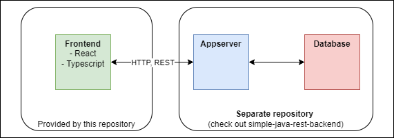
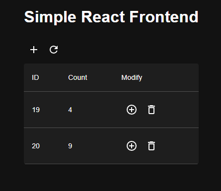

# Simple React Frontend <!-- omit in toc -->

This project contains a simple React frontend that can be used to test your architecture setup (not production ready!). 
You can use the frontend together with the [Simple Java REST Backend](https://github.com/MWSandbox/simple-java-rest-backend) to be able to test a complete 3-tier architecture:
- 

Use the UI to modify the data:
- 

1. [Features](#features)
2. [Useful commands](#useful-commands)
3. [Theme support](#theme-support)

# Features
- Connection to the REST resource `/counter` from the [Simple Java REST Backend](https://github.com/MWSandbox/simple-java-rest-backend) with UI to manipulate the data
- Proxy for local environment to avoid CORS errors

# Useful commands
| Task                             | Command         |
| :------------------------------- | :-------------- |
| Run App locally                  | `npm run start` |
| Build app for remote environment | `npm run build` |
| Install dependencies             | `npm install`   |

# Theme support
This application support light and dark themes through MUI. To test the differences in chrome:
- Open the developer tools
- Open Renderings (CTRL + SHIFT + P --> Show Renderings)
- Switch between Themes by emulating CSS media feature `prefers-color-scheme`